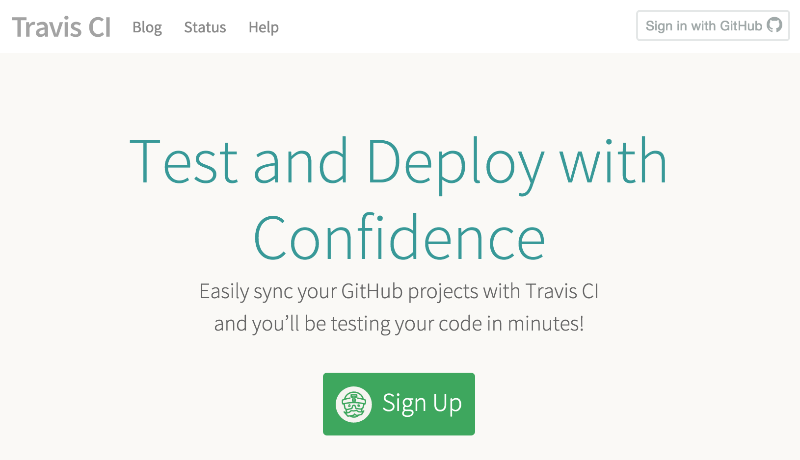
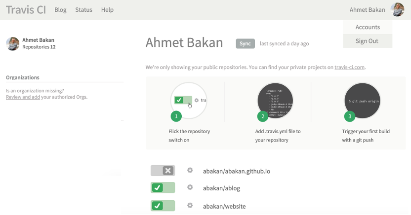
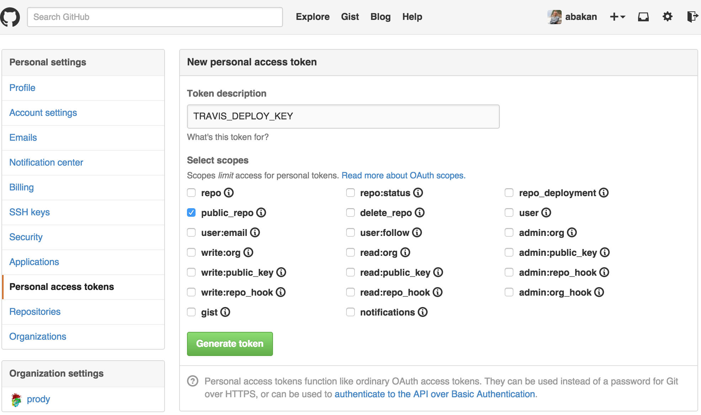
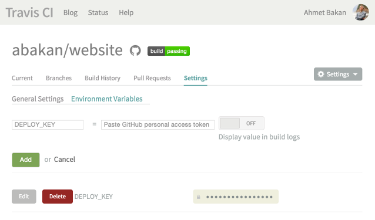
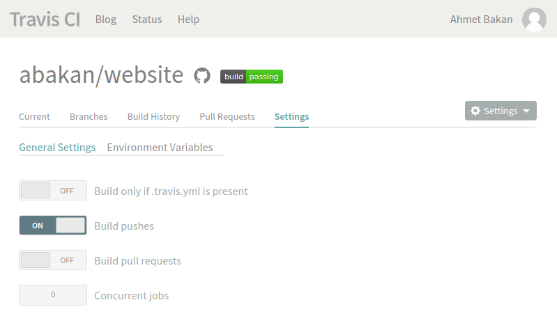

Automate GitHub Pages Deploys
=============================

.. post:: Jun 15, 2015
   :tags: deploy, tips
   :category: Manual
   :author: Ahmet
   :location: Denizli
   :language: en

If being away from your personal computer is holding you from blogging, keep
reading. This post will show you how to automate builds and deploys using
Travis CI. Once you set this up, all you need to do post an article will be
pushing to GitHub or creating a new file on GitHub.com from any computer!

For this to work, you need to be hosting your website on GitHub pages.
If you are not already doing so, see :ref:`deploy-to-github-pages`.

Signup for Travis CI
--------------------

Travis CI is a continuous integration service used to build and test projects
hosted at GitHub. You can easily sync your GitHub projects with Travis CI
by logging to Travis CI using your GitHub account:

Once you login, go to :guilabel:`Account` page and flick the switch on for your GitHub
pages source repository. In the below example, source repository is **website**
and will be pushed to *abakan.github.io*:

Deploy key setup
----------------

To have builds pushed from Travis CI to GitHub, you will need a *personal access
token*. Go to GitHub :menuselection:`Settings --> Personal access tokens` page to 
generate a new token. You need only *public repo* access checked for this purpose:

Then, you need to set this access token as an environment variable, e.g.
``DEPLOY_KEY``, under :menuselection:`Settings --> Environment Variables`.
Keep the :guilabel:Display value in build logs` switch off. 

Also, do not forget to flick :guilabel:`Build pushes` on under
:menuselection:`Settings --> General Settings`:

Configuration file
------------------

Finally, you need a :file:`.travis.yml` in your project that looks like the
following:

.. code-block:: yaml

    language: python

    python:
      - 2.7

    virtualenv:
        system_site_packages: true

    before_install:
      - pip install ablog

    script:
      - ablog build

    after_success:
      - git config --global user.name "Your Name"
      - git config --global user.email "yourname@domain.com"
      - git config --global push.default simple
      - ablog deploy --push-quietly --github-token=DEPLOY_KEY -m="`git log -1 --pretty=%B`"

